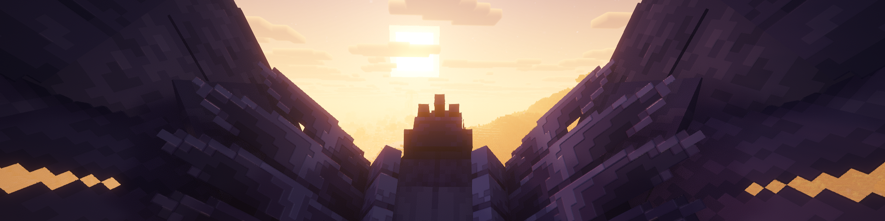
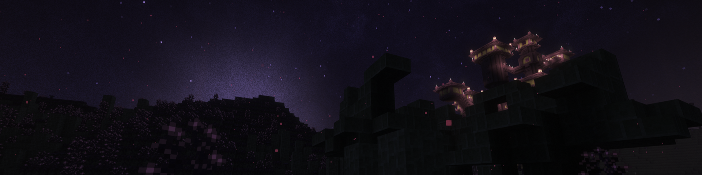
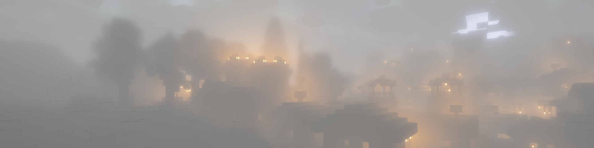
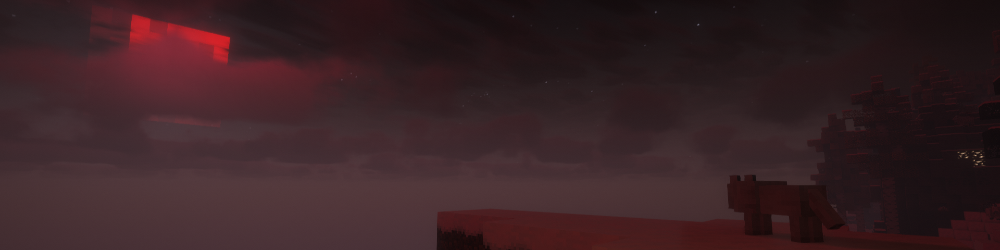

## 1.0.0

It has been awhile from the last update. Thanks for your patience! After much work, I believe the mod is ready to be moved out of the beta phase. The mod has been refactored into a multiloader structure to make it easier to maintain and some APIs have changed (but should be stable now unless otherwise stated). I have also went through most of the existing shaders and made many improvements.

That being said, going forward updates will be slower as I will be entering university soon but I will try my best. Please report any bugs on the issue tracker on GitHub or in the Euphoria Patches discord server. Thanks again!

**Fixes**
- Fix off-by-one error in addition of `colortex` buffers
- Fix shaders not being applied to `suppsquared:copper_lantern`
- Fix issues with Doom & Gloom crashing the game
- Fix bug causing green shading for block entities without IDs
- Fix missing shaders for `caverns_and_chasms:floodlight` and related blocks
- Fix issues with shaders for custom Pokemon not working on Fabric
- Fix handheld lighting not working for `mynethersdelight:powdery_torch`
- Fix missing shaders for `netherexp:wall_ancient_torch` and `netherexp:ancient_campfire`
- Fix issues with Pokemon shaders not working on Fabric 1.21.1

**Additions**
- Significantly improved and added shaders to the following mods
	- Supplementaries (updated to 3.5)
	- Supplementaries Squared
	- Amendments
	- Galosphere
	- Doom and Gloom (updated to Minecraft 1.21.1)
	- Spawn (updated to Minecraft 1.21.1)
	- The Between
	- The Beyond?
	- Caverns & Chasms (updated to Minecraft 1.21.1)
	- Enderscape
		- Add option `DARK_ES_END_FLASH` to configure End Flashes to reduce ambient lighting instead of increasing it
		- Add options `SOFTEN_END_SHADOWS` and `SOFTEN_END_SHADOWS_I` to soften shadows from top-down End ambient lighting. Setting to `0` removes shadows entirely.
	- Cobblemon (more Pokemon shaders :D)
	- My Nether's Delight (updated to 1.10)
	- Jaden's Nether Expansion (updated to Minecraft 1.21.1)
	- Soulful Nether
- Add compatibility with Photonics for the following mods (i.e. ray-tracing for emissive blocks)
	- Enderscape
	- Cinderscapes
	- Frostiful
	- Biomes O Plenty
	- Oh The Biomes We've Gone
- Improvements to cirrus clouds, including support for pixelation and variable cloud cover
- Add support for Mod Menu / Better ModList
- Add ability to control injection points in shader mixins using Regex (works across multiple lines too)
- Add various mod configurations using YetAnotherConfigLib

**Changes**
- Updated to *Minecraft 26.2*
- Updated to *Complementary Shaders r5.8.1 + Euphoria Patches 1.9.3*
- Refactor mod into a multiloader structure that makes it much easier to maintain
- Ensure that errors within the shaderpack will be automatically printed out when the player enters the world
- Shorten patched shaderpack name to `Supplemental Patches <version number>`
- Reworked the settings page to ensure that all resource-packs are able to add their own settings
- Removed spiral clouds above magical biomes as the default cloud map has been changed

**Breaking Changes**
- Standardise all folders to use plurals
	- `entity` -> `entities`
	- `block_entity` -> `block_entities`
	- `translucent` -> `translucents`
- Modify the way that colours are specified within material shader JSONs
	- Field `color` is renamed to `blocklight`
	- Field `conditions` is moved under `blocklight` to allow different `color`s based on different `conditions`
	- See the rewritten shaders within the built-in resource-pack for examples
- Resource-packs now require an `entrypoint.json` within the `settings` folder for shader settings to work
	- Shader settings for each resource-pack will be separated and placed in individual folders
- Renamed waving function `minecraft:waving_tall_foliage_2` -> `waving_tall_emissive_foliage`

---
## 0.8.0-beta

**Fixes**
- Fix issue with missing settings for mods that are not uninstalled
- Fix issues with particle shaders not working with Cobblemon installed

**Additions**
- Add support for the following mods
	- Enderscape (updated to 2.1.0)
	- Cobblemon
- Added shaders for `enderscape:void_shale`
- Add `USE_ENDERSCAPE_LIGHTMAP` option to use Enderscape lightmap in the End instead of the default
- Add `ES_STAR_COLOR`, along with new uniforms `enderscapeStarColor`, `enderscapeStarAlpha` to allow stars to use the colors defined by Enderscape
- Allow individual Pokemon to be given custom shaders (only on NeoForge for now, Fabric mixin doesn't want to work 😢)
	- This is done by adding their showdown ids (e.g. `cobblemon:rowlet`) to entity.properties
	- Only a handful of Pokemon have custom shaders now, more will come in the future
	- This works for custom pokemon too
- Added more information to in-game about page
- Added documentation to wiki on defining mixins and custom fogs

**Changes**
- Updated to *Complementary Shaders r5.7.1 + Euphoria Patches 1.8.6*
- `ANIMATED_END_LAMP` has been changed to be disabled by default

---
## 0.7.1-beta

**Fixes**
- Fix issue with duplicate buffers when reloading shaders
- Fix issues with compatibility with Inventory Particles on Fabric 1.21.10

**Changes**
- Added debug message to indicate number of custom textures and buffers loaded

## 0.7.0-beta

**Fixes**
- Fix issues with atmosphere color multipliers not working if Enderscape is installed
- Fix game crashing if shaderpack fails to compile when Iris debug mode is off
- Fix Doom and Gloom fog not working when effect is active
- Fix crash when `ANIMATED_END_LAMP` is disabled
- Fix crash when `GLOWING_BLOODCAP_MUSHROOM` is enabled

**Additions**
- Add support for the following mods
	- Galosphere (updated to 1.21.5)
	- Enderscape (updated to 1.21.10)
	- Wetland Whimsy (updated to 2.0)
	- Bountiful Fares
	- Dungeons Delight
	- Windswept
- Add ability to easily create new `colortex` buffers
- Add ability to refactor functions to add new parameters
- Add support for End Flash within Enderscape for Minecraft 1.21.10
- Add new uniform `enderscapeFlashColor` for the flash colors in different biomes in Enderscape

**Changes**
- Updated to *Complementary Shaders r5.6.1 + Euphoria Patches 1.7.8*
- *Massively* improved look of emissive objects during Doom and Gloom fog
- Changed various candle shaders not to be emissive when candles are not lit
- Only include material shaders if the relevant mods are installed to reduce compilation time

---

## 0.6.0-beta

**Fixes**
- Fixed the lack of emissivity on Spectres in Species
- Fixed the uncoloured sky-light during lunar events in Enhanced Celestials
- Fix issues where default value of uniforms is null and considered an unknown variable (by @[chililisoup](https://github.com/chililisoup))
- Fixed unexpected nonwhite token in `lumiere_composter.glsl`, `enderscape_nebula.glsl` (by @[chililisoup](https://github.com/chililisoup))

**Additions**
- Add support for the following mods
	- Cinderscapes
	- Enderscape (updated to 1.1.0)
	- Species
	- Aloof
	- Diamonds in the Rough
	- Beeten
	- Enhanced Celestials
- Add new option `reflection_handlers` to specify how opaque blocks should be handled during world-space reflection
- Add ability to inject new functions into `common_functions.glsl` which will be accessible everywhere
- Add `CIRRUS_CLOUDS` option to turn the second layer of unbound clouds into cirrus clouds
- Add new uniforms `moonSize`, `moonColor`, `skylightColor` to handle lunar events from Enhanced Celestials

**Changes**
- Updated to *Complementary Shaders 5.6 + Euphoria Patches 1.7.0*
- Updated to Minecraft 1.21.9
- Errors in the resourcepack and shaderpack are not outputted to the Minecraft chat
- Significantly improved time taken for patching with over 10x improvement (by @[chililisoup](https://github.com/chililisoup))

---
## 0.5.1-beta

**Fixes**
- Fix issues with IDs with `minecraft` namespace not properly replacing IDs in `*.properties` files
- Fix issue with regenerating shaders with keybinds on Fabric
- Replace all `endstone` with `endStone` so shaders will compile on case-sensitive filesystems (e.g. Linux) (thanks @Lightdrew)

**Additions**
- Add support for the following mods
	- Effective
	- Particular
	- Upgrade Aquatic (updated to 1.21.1)
- Add new waving function `minecraft:tall_waving_foliage_2` for foliage that glows (e.g. cave vines)

**Changes**
- System message is now outputted whenever the shaderpack is regenerated after a resource-pack reload

## 0.5.0-beta

**Fixes**
- Fix issues with Enderscape nebula shaders not working with older versions of OpenGL due to use of C-style initialisers

**Additions**
- Add `default` option for uniforms to enable specifying a default value for uniforms to take up if the conditions provided are not met.
- Add `layer.*` option for `block.properties.json` to allow specifying which blocks need to change the layer under which they are rendered (e.g. glass blocks).
- Add ability to inject code to modify ACL fog by placing files under `atmospherics/fog/acl_fogs`
- Add support for the following mods
	- Atmospheric
	- Autumnity
	- Berry Good
	- Environmental
	- Illager Expansion
	- Oh the Biomes We've Gone (including some biome-specific effects!)
	- Snowy Spirit
	- YUNG's Cave Biomes (updated to 1.21.1)
	- Wetland Whimsy (updated to 1.3)
	- End's Delight
- Add shaders for dragon charge from Amendments 2.0
- Added spiral reimagined clouds for magical biomes in BWG and Biomes O Plenty
- Add new setting `DO_DOOM_AND_GLOOM_FOG` to allow fog to be enabled even if Doom and Gloom is not installed

**Changes**
- Slightly improve look of ACL fog when Doom and Gloom Fog is enabled

---
## 0.4.1-beta

**Fixes**
- Fix issue with emissivity for Booflo Adolescent and Booflo Baby shaders
- Add missing Russian translations to Fabric version

**Additions**
- Add full Enderscape support for NeoForge
- Add new setting `ENDERSCAPE_ATMOSPHERE` which enables the revamped Enderscape atmosphere even when Enderscape is not installed

## 0.4.0-beta

**Fixes**
- Fixed issues with voxelization for translucent blocks
- Fixed issues with mod name not displaying properly on NeoForge 1.21.1

**Additions**
- Added support for the following mods
    - Biomes O Plenty
    - Enderscape (including custom skybox 👀)
- Add ability to add custom textures from resource-packs into the shaderpack
- Add ability to add custom skyboxes
- Add new option `dividers` for dividers in settings, to control the amount of whitespace occupied by the divider
- Add new option `activation` for boolean settings that are not used in any `#ifdef` or `#ifndef` statements within the shaderpack
- Add new uniforms `enderscapeNebulaColor`, `enderscapeNebulaAlpha` for the color and opacity of the Enderscape Nebula within the biome the player is currently in
- Add new constants for biomes in Biomes O Plenty and Enderscape
- Added Russian translations thanks to @**[mpustovoi](https://github.com/mpustovoi)**

**Changes**
- Updated to *Complementary Shaders 5.5.1 + Euphoria Patches 1.6.4*
- Built-in shaders have been moved to a built-in resourcepack that can be disabled (Fabric-only)
- Improvements to shaders for
    - Lumisene (Supplementaries)
    - Poise Cluster (Endergetic Expansion)

---
## 0.3.0-beta

**Fixes**
- Fixed shader compilation error when settings such as `COATED_TEXTURES` are enabled
- Fix some issues with block waving for various foliage
- Fix issues with tints working correctly
- Ensure that Iris / Oculus loads the shaderpack only *after* the list of mods is available

**Additions**
- Added support for the following mods
    - Jaden's Nether Expansion
    - My Nether's Delight
    - Pigsteel
    - Soulful Nether
- Added edge effect for Oreganized's Molten Lead and JNE's Ectoplasm
- Added new particle shaders for several particles such as
    - Hollering Souls (Doom & Gloom)
    - Poise Bubble (Endergetic Expansion)
    - Ancient Souls (Wetland Whimsy)
- Add new `block_size` parameter for material shaders, which allows the same GLSL code to be applied across more than 4 material IDs
- Add new uniform `betrayed` for Betrayal effect when Treacherous Candle is activated
- Add new constants for the biomes in Soulful Nether

**Changes**
- Updated to *Complementary Shaders 5.5.1 + Euphoria Patches 1.6.1*
- Optimize how different shaders are applied to particles
- Improvements to shaders for
    - Crystal Glass (Oreganized)
    - Corundum Cluster (Quark)

---
## 0.2.0-beta

**Fixes**
- Fixed crash on Fabric 1.21.4
- Fixed shaders for sonar waves for Upgrade Aquatic
- Fixed fade-out effect when Doom & Gloom's fog effect ends
- Fixed rendering of Holler from Doom & Gloom
- Fixed haunt uniforms for Trailier Tales
- Fixed rendering of item shaders within Supplementaries pedestals, item shelves, etc.
- Fixed issues with indentation when using shader mixins

**Additions**
- Added support for the following mods
    - Endergetic Expansion
    - Buzzier Bees
    - Rodspawn
    - Nears
    - Gipples Galore
    - Frostiful
    - Scorchful
- Added the uniform `scorchfulSandstorm` to identify where Scorchful's sandstorms take place
- Add experimental volumetric atmospheric effects features, which will continue to be fleshed out in future updates

**Changes**
- Changed uniforms `sandstorm` and `sandstormWindSpeed` to `yungSandstorm` and `yungSandstormWindSpeed`

---
## 0.1.0-beta

**Fixes**
- Fixed missing Thrasher tails from Upgrade Aquatic
- Fixed fog effect from Doom & Gloom
- Fixed sandstorm effect within Lost Caves from YUNG's Cave Biomes

**Additions**
- Added support for the following mods
    - Quark
    - Supplementaries
    - Twigs
    - Dye Depot
    - Galosphere
    - Upgrade Aquatic
    - Caverns & Chasms
    - Savage & Ravage
    - Oreganized
    - Doom & Gloom
    - Wetland Whimsy
    - YUNG's Cave Biomes
    - Friends & Foes
    - Enderman Overhaul
    - Farmer's Delight
    - Pearfection
    - Trailier Tales
- Added features to add custom shaders for
    - Blocks & Block Entities
    - Entities
    - Items
    - Particles
    - Fog
- Allow definition of custom ACL colors and tints
- Allow creation of custom waving motion for blocks / block entities
- Add ability to add custom uniforms and settings
- Add shader mixins to directly modify Euphoria Patches code through a resource-pack